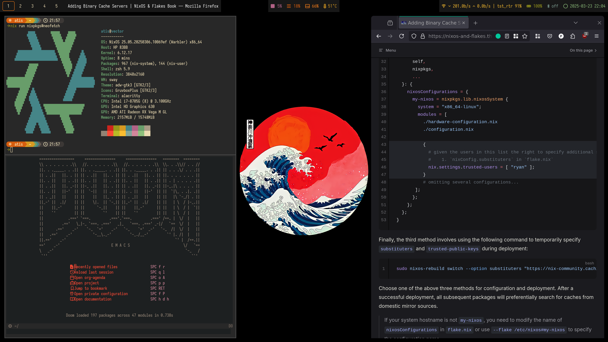
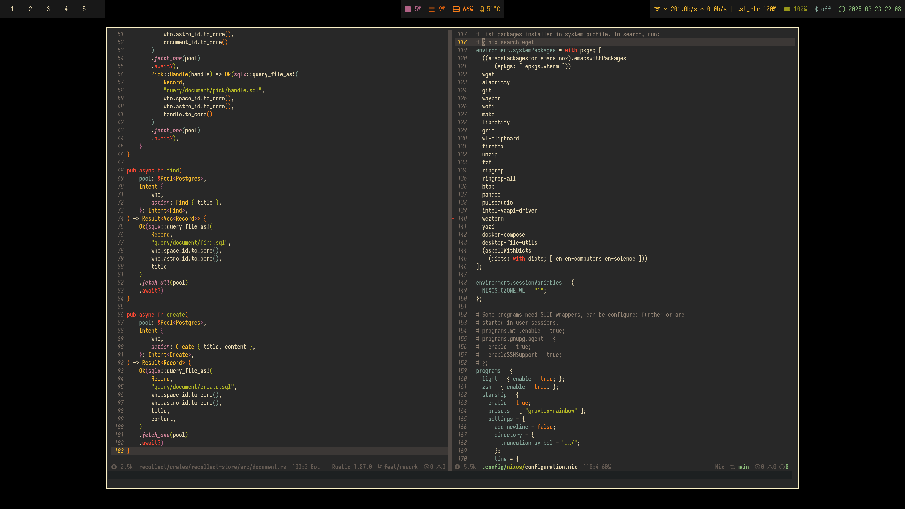

# Personal NixOS Configuration




My declarative way to manage Linux system configuration, including packages, system settings, and development environment using [NixOS](https://nixos.org) and [Home Manager](https://github.com/nix-community/home-manager).

For my declarative way to manage MacOS system configuration, see https://github.com/CuriousCorrelation/nix-darwin

## Why?

### Reproducibility
- Ever had to set up a new machine and thought, "this will take days"? Not anymore!
- No more scattered dotfiles or "what did I install again?" moments.
- If you work on developing cross-platform apps, sometimes you need to nuke your system 🥲 this way, you can get it back up and running in a blink.

### Declarative Configuration
- Your entire system setup is in code—like Infrastructure as Code, but for your PC.
- That moment when an update breaks everything? Roll back instantly, just `git reset` to go back in time!
- Share your setup with your team without writing a 50-page wiki document.

### Isolation
- Need Python 2.7 for that legacy project but Python 3.11 for the new stuff? No problem!
    - Though maybe it's time to rewrite it in Rust? 🦀
- Want to try something new? Just `nix run nixpkgs#cowsay -- "Hello"` without installing anything.
- No more "but it works in development" when your local Node version is different from production.
    - Though maybe it's time to rewrite it in Rust? 🦀
- Each project gets its own little world with exactly what it needs.

### Collaboration
- Share your setup with your team without writing a 50-page wiki document.

## Installation, or how I finally stopped distro-hopping

### 1. Install NixOS
First, download and install NixOS from the [official website](https://nixos.org/download.html).

During installation, you can use the generated configuration as a starting point.

### 2. Clone this repository
After installing NixOS, clone this repo:
```bash
git clone https://github.com/YourUsername/nixos-avion.git
```

> [!WARNING]
> The following configuration changes are **required** before building. The system won't work correctly without updating these details.

### 3. Set up system configurations
Move the NixOS system configuration files to `/etc/nixos`:
```bash
sudo cp -r nixos-avion/nixos/* /etc/nixos/
```

Update your personal information in `/etc/nixos/configuration.nix`:
```nix
networking.hostName = "your-hostname";  # Replace with your hostname

users.users.yourusername = {  # Replace with your username
  isNormalUser = true;
  description = "Your Name";  # Replace with your full name
  extraGroups = [ "networkmanager" "wheel" "video" "audio"];
  packages = with pkgs; [];
  shell = pkgs.zsh;
};
```

### 4. Set up Home Manager configurations
Copy the Home Manager configuration to your user's config directory:
```bash
mkdir -p ~/.config/home-manager
cp -r nixos-avion/home-manager/* ~/.config/home-manager/
```

Update your personal information in `~/.config/home-manager/home.nix`:
```nix
home.username = "yourusername";  # Replace with your username
home.homeDirectory = "/home/yourusername";  # Replace with your home directory

programs.git = {
  userEmail = "your.email@example.com";  # Replace with your email
  userName = "Your Name";                # Replace with your name
};
```

### 5. Build the Configurations
After updating your personal information, build and activate the system configuration:
```bash
sudo nixos-rebuild switch --flake /etc/nixos#default
```

Then, apply your Home Manager configuration:
```bash
home-manager switch --flake ~/.config/home-manager#yourusername
```

> [!NOTE]
> The first build might take some time as it downloads and builds all required packages.

## Flake Structure
This configuration uses flake inputs:
- `nixpkgs`: The main Nix packages repository
- Other inputs can be added to `flake.nix` as needed

## Configuration Structure

### Core Configuration
* [flake.nix](nixos/flake.nix) - Flake configuration and inputs

### NixOS Configurations
* [configuration.nix](nixos/configuration.nix) - Main system configuration
* [hardware-configuration.nix](nixos/hardware-configuration.nix) - Hardware-specific settings

### Home Manager Configurations
* [home.nix](home-manager/home.nix) - Main user environment configuration
* [zsh](home-manager/zsh/) - Shell configuration
* [p10k](home-manager/p10k/) - Powerlevel10k theme for ZSH

## Usage

### Adding New Packages
Edit the appropriate configuration file:
- System packages: `/etc/nixos/configuration.nix`
- User packages: `~/.config/home-manager/home.nix`

### Updating System
To update all packages and apply changes:
```bash
cd /etc/nixos
nix flake update  # Updates all flake inputs
sudo nixos-rebuild switch --flake .#default
```

> [!TIP]
> You can update specific inputs using `nix flake lock --update-input nixpkgs` for example.

### Using Home Manager
To update your Home Manager configuration:
```bash
cd ~/.config/home-manager
home-manager switch --flake .#yourusername
```

### Troubleshooting
1. Check logs: `journalctl -b`
2. Run with verbose output: `sudo nixos-rebuild switch --flake .#default --verbose`
3. Check Nix store: `nix store verify --all`

> [!TIP]
> If you get permission errors, make sure you've properly set up your username in the configuration files.

## Resources
- [NixOS Manual](https://nixos.org/manual/nixos/stable/)
- [Home Manager Manual](https://nix-community.github.io/home-manager/)
- [Nix Flakes](https://nixos.wiki/wiki/Flakes)
- [NixOS Options](https://search.nixos.org/options)
- [Nixpkgs](https://search.nixos.org/packages)
